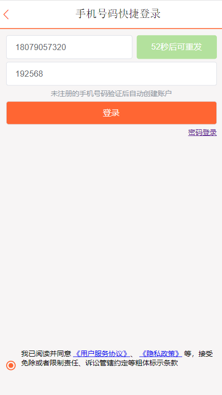
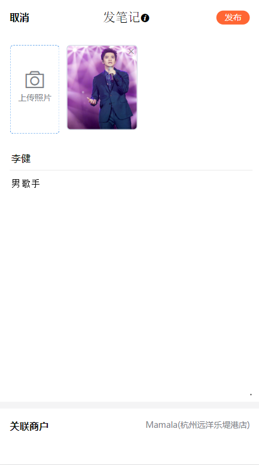

#### 关于本地运行

可直接导入该项目于本地，修改配置文件application.yml中的MySQL和Redis连接信息，以及src目录下的RedisConfig连接配置即可

#### 项目介绍

本项目采用Redis作为缓存技术，SpringBoot作为基础框架，通过MyBatis-plus作为持久层框架

### 项目功能

1.通过短信验证码实现登录

2.发布的动态可以关联商品

3.点赞关注等

#### 页面展示

首页

登录页面

